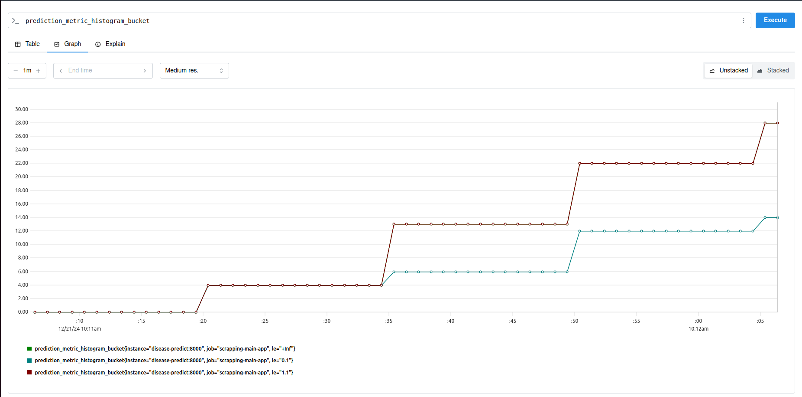
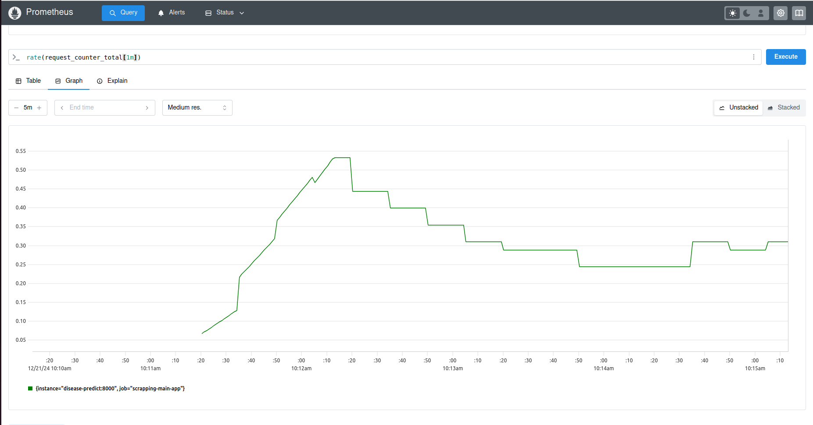
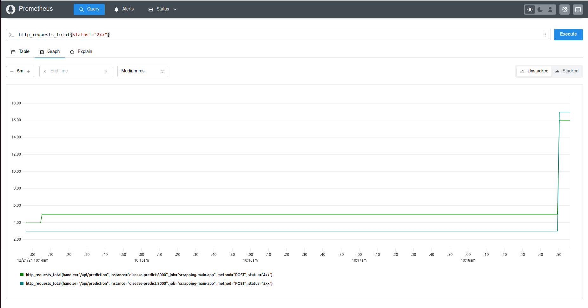
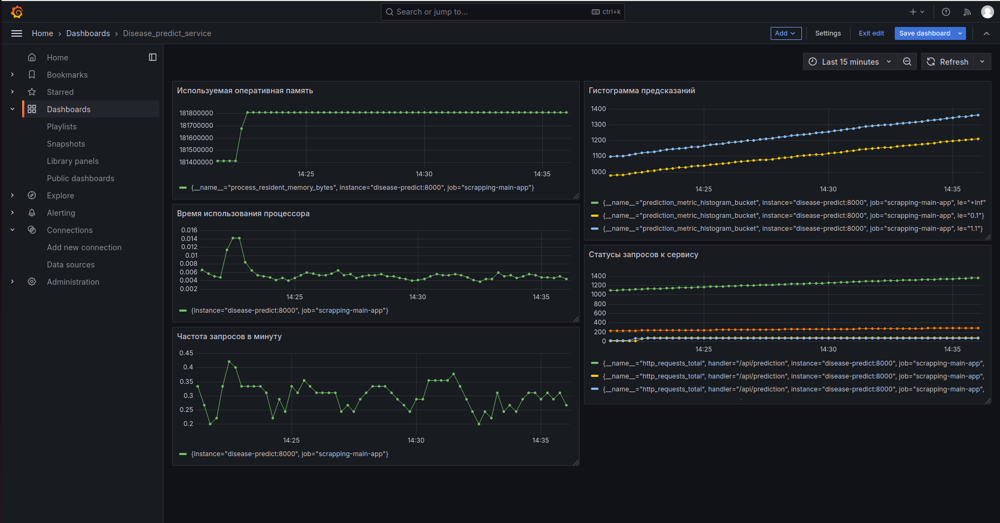

### Описание проекта

В данном проекте разработан сервис, который использует обученную модель для предсказания заболевания человека. Также добавлена возможность мониторинга сервиса.

В данном проекте использовались следующие технологии и библиотеки:

- **Docker** для контейнеризации всех сервисов.
- **Docker Compose** для упрощения настройки и запуска всего проекта.
- **Prometheus** для мониторинга метрик.
- **Grafana** для визуализации данных и создания дашбордов.
- **Python** для реализации скриптов.
- **Flask** для разработки сервиса предсказаний. 

---

### Подготовка к запуску проекта

Первоначально нам нужно зайти в папку, в которую мы хотим скопировать наш проект, либо указать необходимую папку при клонировании. Это можно сделать с помощью команд:

**cd IIS**

**git clone url https://github.com/MosalovKD/IIS.git**

Чтобы создать виртуальную среду (с использованием Python), вам необходимо выполнить следующие команды:

**python3 -m venv .venv_IIS_proj**

**source .venv_IIS_proj/bin/activate**

Чтобы установить все необходимые библиотеки в виртуальную среду, необходимо использовать команду:

**pip install -r requirements.txt**

### Запуск MLFlow

Скрипт для запуска MLFlow находится в папке *mlflow* в файле *start_mlflow*.

Для локального развертывания MLFlow достаточно перейтив папку со скриптом и выполнить команду:

**sh start_mlflow.sh**

После чего можно проверить, что фреймворк успешно запустился, пройдя в браузере на *http://localhost:5000/*

---

### Исследование данных

В результате исследования:

* Изменен тип данных с числового на категориальный для 9 столбцов (sex, cp, fbs, restecg, exang, slope, ca, thal, target)
* Изменен тип данных с int64 на int8/int16 для 4 столбцов (age, trestbps, chol, thalach)
* Изменен тип данных с float164 float16 для 1 столбца (oldpeak)
* Удален признак 'chol' вследствие неинформативности.

При построении графиков были выделены следующие закономерности:

1. Из графика распределения целевой переменной (наличия заболевания) - кол-во наблюдений в каждой группе примерно одинаково, что не повлияет на качество обучения модели в будущем. (см. график: ./eda/graph1.png)
2. Из графика распределение пола в зависимости от наличия заболевания - заболевания у мужчин встречаются чаще чем у женщин. (см. график: ./eda/graph2.png)
3. Из графика корреляций признаков - наблдается обратная зависимоть между возрастом и максимальным кол-вом сердченых скоращений, примерно такая же зависимоть наблюдается между частотой сердечных скоращний и ST-маркером. Корреляция остальных признаков слабая. (см. график: ./eda/graph3.png)
4. Из графика зависимости уровня холестерина от возраста - уровень холестерина достаточно неинформативный признак для определения целевой переменной и линейная зависимость ненаблюдается. (см. график: ./eda/graph4.png)
5. Из графика заисимости максимальной частоты сердечного ритма от возраста - достаточно хорошо прослеживается обратная заисимость между возрастом и максимальным середчным ритмом, при этом можно отметить, что наблюдения с более высоким сердречным ритмом чаще поджвержены заболеваниям. (см. график: ./eda/graph5.png)
6. Из графика зависимотси наличия заболевания от типа боли в груди - типы болей 2, 3 и 4 намного чаще соответствуют наличию заболевания, в отличие от типа болей 1. (см. график: ./eda/graph6.png)
7. Из гистограммы распределения возраста с маркеровкой наличия заболевания - группа людей возрастом от 34 до 55 лет наиболее подвержена заболеваниям. (см. график: ./eda/graph7.png)


**Начальный объем датасета: 11.3 KB —> Итоговый объем датасета: 7.9 KB**

---

### Результаты исследования

В ходе исследования было построено несколько моделей. Все модели показали достаточно хорошие результаты, однако лучшие результаты были получены у модели с расширенным кол-вом признаков (предобработка столбцов с помощью PolynomialFeatures) и оптимальными параметрами, которые были получены с помощью библиотеки optuna.

Метрики полученные при обучении модели следующие:

* accuracy - 0.9285714285714286
* precision - 0.9285714285714286
* recall - 0.9285714285714286
* f1 - 0.9285714285714286
* roc_auc - 0.9770408163265306

Данные метрики получены при следующих параметрах модели:

* n_estimators = 51
* max_depth = 20
* max_features = 0.8598853604010984

RunID финальной модели: **ef398bd7999048098a97d90850652408**

---

### Описание разработанного сервиса
Этот сервис предоставляет API для выполнения предсказаний с использованием модели машинного обучения. Модель была обучена ранее, сохранена через MLflow, и интегрирована в данный сервис.

**Основные папки и файлы:**
- `ml_service/`:
  - `main.py`: основной модуль приложения FastAPI.
  - `api_handler.py`: класс-обработчик API запросов, содержащий логику работы с моделью и предсказаниями.
  - `requirements.txt`: файл зависимостей, необходимых для работы сервиса.
  - `Dockerfile`: инструкции для сборки Docker-образа сервиса.
- `models/`:
  - `get_model.py`: скрипт для загрузки модели из MLflow.
  - `model.pkl`: сериализованная модель машинного обучения, используемая сервисом.
  
### Команды для создания Docker-образа
Сборка образа выполняется с помощью команды:
```
docker build . --tag disease_model:0
```

### Команда для запуска контейнера
Для запуска контейнера с пробросом порта и подключением модели выполните следующую команду:
```
docker run -p 8001:8000 -v $(pwd)/../models:/models disease_model:0
```
### Проверка работоспособности сервиса
1. Перейдите на страницу документации FastAPI по адресу:
   [http://localhost:8001/docs](http://localhost:8001/docs)

2. Выполните запрос к эндпоинту `/api/prediction`:
   **Пример тела запроса**:
```  
{"age":34,
"sex":0,
"cp":2,
"trestbps":130,
"fbs":0,
"restecg":2,
"thalach":148,
"exang":0,
"oldpeak":3.5
"slope":0,
"ca":0,
"thal":1 
}
```

---

### Описание мониторинга сервиса

**Описание разработанных сервисов**:
   - **Grafana**:
     - Сервис мониторинга и визуализации данных.
     - Включает в себя файлы для конфигурации, а также дашборды для отображения метрик.
     - Веб-интерфейс доступен по адресу `http://localhost:3000`.
     - Для доступа используется логин и пароль: `admin:admin`.

   - **Prometheus**:
     - Сервис для сбора и хранения метрик.
     - Конфигурационный файл для Prometheus расположен в директории `./services/prometheus`.
     - Веб-интерфейс доступен по адресу `http://localhost:9090` (если порт 9090 не занят на хосте).
     - Prometheus собирает метрики сервиса предсказаний и отображает их через графики.

   - **Сервис отправки запросов (requests)**:
     - Скрипт, который генерирует случайные запросы к сервису предсказаний с промежутками времени от 0 до 5 секунд.
     - Позволяет протестировать стабильность и нагрузку на сервис предсказаний.
     
Для сборки и запуска проекта с использованием Docker Compose, используйте команду, находясь в папке `services`:

```
docker-compose up
```

Пример мониторинга сервиса:

Гистограмма предсказаний:


Частота запросов к сервису:


Запросы со статусом 4хх и 5хх:


Дашборд с использованием Grafana:

Панель:


Помимо графиков, полученных в Prometheus (прикладные), были добавлены графики используемой памяти и времени использования процессора (инфраструктурные).
